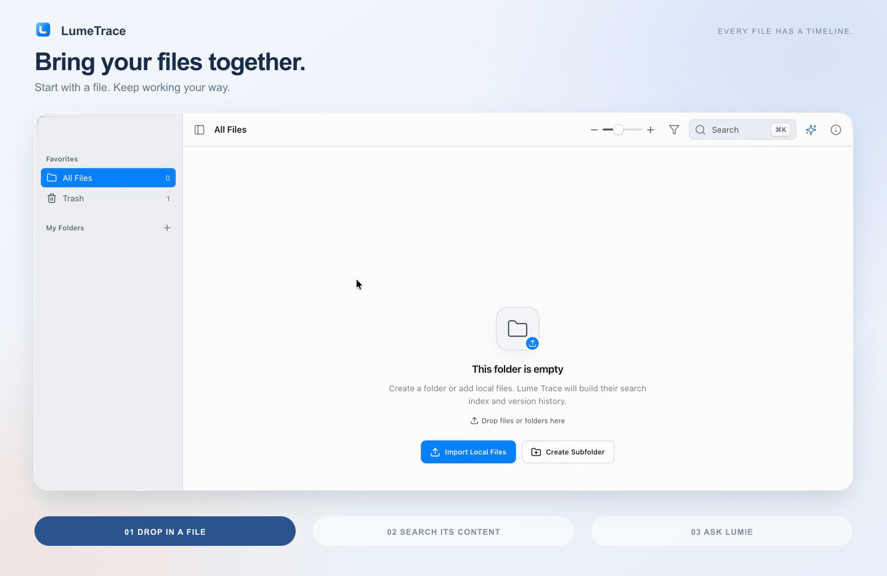

<p align="center">
  
</p>

<h1 align="center">Every file has a timeline.</h1>

<p align="center">LumeTrace is a local-first file manager for macOS,<br>built around automatic version history and visual diffs.</p>

<p align="center">Organize your files, keep using your favorite editor, and trace, compare, or restore earlier versions.</p>

<p align="center">
  <a href="docs/media/lumetrace-overview.gif">
    
  </a>
</p>

<p align="center">
  <a href="docs/README.zh-CN.md">简体中文</a> ·
  <a href="docs/media/lumetrace-overview.gif">View full-size demo</a> ·
  <a href="docs/DEVELOPMENT.md">Development guide</a>
</p>

## See every change

Automatically record every save. Visually compare every change. Restore an earlier version when you need to go back.

<p align="center">
  <a href="https://i.ibb.co/67XxPbbT/1.gif">
    
  </a>
</p>

## How it works

1. **Edit your file.** Work and save as usual — in LumeTrace or your favorite editor.
2. **Watch its timeline grow.** Changes are automatically recorded as new versions of the same file.
3. **Compare any two versions.** Pick two points in the timeline and see exactly what changed with Diff.

<p align="center">
  
</p>

One file. A complete history. No more `final_final_v2_really_final.md`.

## Built for your files

Keep projects separate, recover earlier work, and find what matters — with optional AI when you need a second pair of eyes.

<table>
  <tr>
    <td width="50%" valign="top">
      
      <h3>File workspaces</h3>
      <p>Start fresh or bring an existing folder. Name and switch between workspaces, each with its own file records, versions, search indexes, Trash, and AI history.</p>
      <p>Your physical files stay in the folder you choose.</p>
    </td>
    <td width="50%" valign="top">
      
      <h3>Restore earlier work</h3>
      <p>Preview an older version and make it current without discarding the rest of its history. Recover deleted files from Trash, or export and restore a LumeTrace backup.</p>
      <p>A way back when you need it.</p>
    </td>
  </tr>
  <tr>
    <td width="50%" valign="top">
      
      <h3>Find more than a file name</h3>
      <p>Press <kbd>⌘ K</kbd> to search file names, extracted text, and Tags. Find a note by something written inside it, even when you have forgotten what you called it.</p>
      <p>Full-text search works without an AI service.</p>
    </td>
    <td width="50%" valign="top">
      
      <h3>Lumie, your AI file assistant</h3>
      <p>Ask in natural language, follow up, or summarize the changes between versions — with references you can open and inspect.</p>
      <p>Connect Ollama, LM Studio, an OpenAI-compatible cloud API, or a supported Agent CLI. AI is optional.</p>
    </td>
  </tr>
  <tr>
    <td width="50%" valign="top">
      
      <h3>Search by meaning, locally</h3>
      <p>Download the optional Multilingual E5 Small model from Hugging Face to add meaning-based relevance to search and AI retrieval. Text and vectors stay on your Mac during indexing.</p>
      <p>Follow indexing progress, pause work, or retry failed tasks.</p>
    </td>
    <td width="50%" valign="top">
      
      <h3>Your language. Your look.</h3>
      <p>Choose from eight interface languages: English, Simplified Chinese, Traditional Chinese, Japanese, Korean, German, French, and Spanish.</p>
      <p>Use light, dark, or system appearance, with an accent color that feels like yours.</p>
    </td>
  </tr>
</table>

*Feature illustrations use example content; they are not application screenshots.*

<details>
<summary>AI service compatibility</summary>

Choose a service in Preferences. You do not need an AI service for file browsing, version tracking, Diff, full-text search, or local semantic indexing.

| Service | Connection | Status |
| --- | --- | --- |
| Ollama | Native Ollama API | Supported |
| LM Studio | OpenAI-compatible API | Supported |
| Cloud API | OpenAI-compatible API with your own key | Supported |
| Hermes CLI | Installed Agent CLI | Supported |
| Codex CLI | Installed Agent CLI | Supported |
| Claude Code | Installed Agent CLI | **Experimental** |
| OpenCode | Installed Agent CLI | **Experimental** |

Claude Code and OpenCode are available to try, but are not yet fully validated for everyday use. Connection checks confirm service availability; they do not guarantee answer quality.

</details>

## Get started

LumeTrace is a free, single-user macOS app. The [v1.0.0 source release](https://github.com/gurudin/lumetrace/releases/tag/v1.0.0) is available; no packaged installer is attached to that release yet. For now, [run from source](#development).

1. **Create a workspace.** Give it a name and choose a new or existing folder. For an existing folder, let file registration finish first.
2. **Make a change.** Create or open a Markdown or text file, edit it, and save — in LumeTrace or your usual editor.
3. **See its history.** Open the file's timeline, select two versions, and inspect the Diff. Make an earlier version current whenever you need to go back.

Text extraction and optional semantic indexing continue in the background after import. You can check their progress in Preferences; neither is required to start exploring a file's timeline.

## Your files stay yours

- **Local files and history.** Your files stay in the folder you choose. Workspace metadata, version snapshots, search indexes, Trash records, and AI conversations are stored locally.
- **Local semantic indexing.** The optional E5 model downloads from Hugging Face. Building its index does not upload workspace content.
- **AI only when you ask.** Your question, limited recent context, file identities, and relevant excerpts or a requested version Diff may be sent to your chosen model, cloud API, or Agent CLI. LumeTrace does not send the entire workspace as one request.
- **Know what is stored.** Cloud API keys are stored locally without encryption and excluded from exported backups. Backup archives are not encrypted either; keep them somewhere safe.

## Good to know

**Can I keep using my editor?**

Yes. Changes made by other applications are detected in the background and recorded in the file's timeline. Removing a workspace does not silently delete its physical folder.

**Which files can I compare or search?**

Line- and word-level Diff is available for supported text files, including Markdown, plain text, and source code. Full-text indexing can also extract readable text from PDF, DOCX, XLSX, and PPTX files. OCR for scanned documents and images is not included.

**Does a timeline replace a backup?**

No. Local history helps undo changes, but it is not an independent backup of your Mac. Export backups and keep a separate copy. Deleted items remain in Trash for up to 30 days unless you permanently remove them sooner.

**Does it sync or migrate another app's library?**

Not in v1.0.0. LumeTrace is a local, single-user workspace, without team sharing, NAS/cloud sync, or cross-device conflict resolution. You can import physical folders and restore LumeTrace backups; app-specific library migrations, such as Eagle, are not supported. Dot-prefixed hidden directories are excluded during folder initialization. See [import and backup details](docs/MIGRATION.md).

Windows and Linux installers are not currently available.

## Feedback & community

- [GitHub Issues](https://github.com/gurudin/lumetrace/issues) — report a bug, suggest an improvement, or follow its progress.
- [Discord](https://discord.gg/6pJVMTJ5UG) — ask questions and share how you use LumeTrace.

When reporting a bug, include your app and macOS versions, steps to reproduce it, and a screenshot if useful. Remove private file contents and API keys before sharing logs or screenshots.

## Development

Requires Node.js/npm, Rust, and the [Tauri 2 prerequisites for macOS](https://v2.tauri.app/start/prerequisites/). From a local checkout:

```bash
npm install
npm run tauri:dev
```

Use development mode for local work; do not install development builds into `/Applications`. See the [development guide](docs/DEVELOPMENT.md) for architecture, AI integration details, and test commands.

## License

LumeTrace is licensed under the [GNU Affero General Public License v3.0](LICENSE) (`AGPL-3.0-only`).

Third-party components retain their respective licenses.
